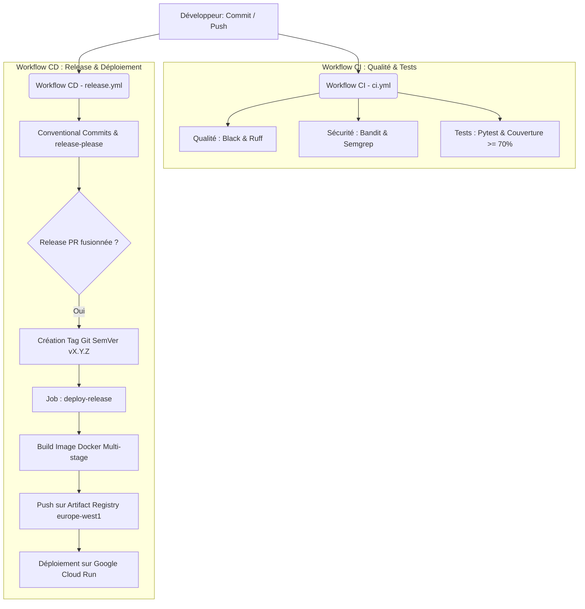

# Compte-Rendu de TP 1 — Découverte de Git

---

## Partie 1 — Concepts de base et commandes de suivi

### Question 1 : Que contient le répertoire .git/ ? À quoi sert-il ?

Le répertoire `.git/` contient l'ensemble des fichiers de configuration, d'historique de commits, de métadonnées et de base de données d'objets (commits, blobs, trees, tags) nécessaires à la gestion de version locale de notre projet.
Il contient notamment :
*   `config` : La configuration locale du dépôt (URL distante, branches suivies, etc.).
*   `hooks/` : Scripts de personnalisation exécutés lors de certaines actions (pre-commit, pre-push, etc.).
*   `info/exclude` : Fichier permettant d'exclure localement certains fichiers sans avoir à les ajouter au `.gitignore`.
*   `objects/` : La base de données de contenu contenant tous les commits, arbres de fichiers (trees) et fichiers zippés (blobs).
*   `refs/` : Les pointeurs vers les commits des branches locales (`heads`), distantes (`remotes`) et des tags (`tags`).

---

### Question 2 : Quelle est la différence entre un fichier untracked, staged et committed ?

*   **Fichier `untracked` (non suivi) :** Le fichier existe dans votre répertoire de travail local, mais Git ne le suit pas encore. Aucun historique n'est enregistré pour ce fichier.
*   **Fichier `staged` (indexé) :** Le fichier a été préparé en vue d'être inclus dans le prochain commit (via la commande `git add`). Les modifications actuelles sont enregistrées dans la zone d'index.
*   **Fichier `committed` (enregistré) :** Les modifications présentes dans la zone d'index ont été validées et sauvegardées de manière permanente dans la base de données locale de Git (via `git commit`). Le fichier dispose maintenant d'un point dans l'historique.

---

### Question 3 : Quelle est la différence entre git diff et git diff --staged ? À quel moment utiliseriez-vous chacune ?

*   **`git diff` :** Compare les fichiers du répertoire de travail actuel avec la zone d'index (`staged`).
    *   *Quand l'utiliser :* Pour examiner les modifications en cours d'écriture avant de les préparer via un `git add`.
*   **`git diff --staged` (ou `--cached`) :** Compare la zone d'index (`staged`) avec le tout dernier commit (`HEAD`).
    *   *Quand l'utiliser :* Pour vérifier exactement quelles modifications ont été indexées et s'apprêtent à être enregistrées par le prochain `git commit`.

---

### Question 4 : Quelle est la différence entre git revert et git reset ? Dans quel cas utiliser l'un ou l'autre ?

*   **`git revert` :** Crée un tout nouveau commit qui applique les modifications inverses d'un commit ciblé. Il n'altère pas l'historique existant.
    *   *Quand l'utiliser :* Idéal lorsque l'on travaille sur une branche partagée ou publique (comme `main`), car cela préserve l'historique sans perturber les autres collaborateurs.
*   **`git reset` :** Déplace le pointeur de branche (`HEAD`) vers un commit précédent, supprimant ou déplaçant les commits suivants selon le mode (`--soft`, `--mixed`, `--hard`).
    *   *Quand l'utiliser :* À utiliser sur des branches locales privées avant de les publier, pour nettoyer ou annuler des commits ratés. `--hard` est à manipuler avec prudence car il supprime définitivement les modifications du répertoire de travail.

---

## Partie 2 — Branches et Fusions

### Question 5 : Qu'est-ce qu'un fast-forward merge ? Dans quel cas Git effectue-t-il un fast-forward plutôt qu'un merge commit ?

*   **Fast-forward merge :** Mode de fusion rapide dans lequel Git déplace simplement le pointeur de la branche actuelle directement vers le commit le plus récent de la branche fusionnée, sans créer de commit de fusion (merge commit) supplémentaire.
*   **Quand se produit-il :** Lorsque la branche à fusionner a été créée à partir du même commit que la branche cible (ex: `main`), et qu'aucun autre commit n'a été ajouté sur la branche cible depuis cette séparation. S'il y a eu de nouvelles modifications sur la branche cible, Git effectuera un merge commit à la place.

---

### Question 6 : Pourquoi est-il recommandé de supprimer les branches une fois fusionnées ? Quelle différence entre -d et -D ?

*   **Pourquoi supprimer :** Pour maintenir le dépôt propre, lisible et éviter d'accumuler des branches obsolètes qui surchargent l'historique et compliquent la maintenance.
*   **Différence entre `-d` et `-D` :**
    *   `git branch -d` (option sûre) : Supprime la branche uniquement si elle a déjà été entièrement fusionnée dans la branche parente.
    *   `git branch -D` (option forcée) : Supprime la branche de force sans vérifier son statut de fusion, utile pour abandonner des branches de fonctionnalités ratées.

---

### Question 7 : Décrivez en vos propres mots ce qu'est un conflit Git, pourquoi il survient, et quelles sont les étapes pour le résoudre.

*   **Qu'est-ce qu'un conflit Git :** C'est une situation où Git est incapable de fusionner automatiquement deux versions différentes d'un fichier et demande l'arbitrage d'un humain.
*   **Pourquoi survient-il :** Il survient lorsque deux branches modifient la même ligne d'un même fichier, ou lorsqu'un fichier est modifié sur une branche et supprimé sur l'autre avant la fusion.
*   **Étapes pour le résoudre :**
    1. Ouvrir le fichier en conflit pour identifier les marqueurs de conflit (`<<<<<<< HEAD`, `=======`, `>>>>>>>`).
    2. Utiliser un éditeur ou un outil de diff pour choisir quelles modifications conserver (ou combiner les deux).
    3. Supprimer les marqueurs de conflit.
    4. Marquer le conflit comme résolu en ajoutant le fichier à la zone d'index via `git add <fichier>`.
    5. Finaliser la fusion en exécutant `git commit`.

---

## Partie 3 — Collaboration et Gestion de projet

### Question 8 : Quelle est la différence entre git fetch et git pull ? Dans quel cas préférer l'un à l'autre ?

*   **`git fetch` :** Récupère les métadonnées et les nouveaux commits du dépôt distant vers le dépôt local, sans modifier vos branches de travail actuelles.
    *   *Quand l'utiliser :* Pour inspecter les modifications distantes de vos collaborateurs avant de décider de les intégrer, évitant ainsi les conflits inattendus.
*   **`git pull` :** Récupère les commits distants (équivalent de `git fetch`) et les fusionne immédiatement dans votre branche de travail locale actuelle (équivalent de `git merge`).
    *   *Quand l'utiliser :* Lorsque vous savez que votre branche locale est propre et que vous souhaitez simplement mettre à jour votre branche de travail en y fusionnant le travail distant directement.

---

### Question 9 : Quel est l'intérêt d'utiliser des Pull Requests plutôt que de pousser directement sur main ? Quels éléments vérifiez vous lors d'une code review ?

*   **Intérêts des Pull Requests (PR) :**
    *   **Sécurité et stabilité :** Protège la branche `main` contre l'introduction accidentelle de bugs ou de régressions qui casseraient l'application en production.
    *   **Code Review :** Permet la discussion, le partage de connaissances et la relecture de code par les pairs avant intégration.
    *   **CI/CD :** Permet de déclencher automatiquement les tests et validations de qualité de code sur la branche de fonctionnalité avant fusion.
*   **Éléments à vérifier lors d'une Code Review :**
    *   Le code résout-il correctement le problème ou implémente-t-il bien le besoin demandé ?
    *   Le style et les normes de codage (nommage, formatage) sont-ils respectés ?
    *   Le code contient-il des failles de sécurité potentielles ou des secrets en clair ?
    *   Des tests unitaires appropriés ont-ils été ajoutés et couvrent-ils bien le nouveau code ?

---

### Question 10 : Pourquoi est-il important de ne pas versionner certains fichiers ? Donnez 3 exemples de fichiers à exclure et expliquez pourquoi pour chacun.

*   **Pourquoi exclure certains fichiers :** Pour éviter de pousser des informations sensibles (secrets), de polluer le dépôt avec des fichiers générés temporairement ou d'introduire des fichiers volumineux qui ralentissent le dépôt et diffèrent selon la machine du développeur.
*   **3 exemples à exclure :**
    1.  **Fichiers de secrets / configuration locale (ex: `.env`) :** Contiennent des mots de passe, clés d'API ou identifiants de base de données. Les committer poserait de graves risques de sécurité.
    2.  **Environnements virtuels (ex: `venv/`, `.venv/`) :** Contiennent des milliers de dépendances installées localement. Ils n'ont pas besoin d'être versionnés car ils peuvent être réinstallés via le fichier `requirements.txt`.
    3.  **Fichiers temporaires ou compilés (ex: `__pycache__/`, `.pyc`, `.pytest_cache/`) :** Fichiers générés automatiquement par l'interpréteur Python ou les outils de test, spécifiques à l'exécution courante, provoquant d'inutiles conflits de fusion s'ils sont versionnés.

---

# Compte-Rendu de TP 2 — Intégration Continue (CI)

---

## Partie 1 — Premiers pas avec GitHub Actions

### Question 1 : Décrivez la structure du fichier ci.yml : que signifient on, jobs, runs-on, steps et uses ?

*   **`on` :** Définit les déclencheurs (triggers) du workflow (ex: push ou pull_request sur une branche spécifique).
*   **`jobs` :** Regroupe les tâches indépendantes exécutées par le workflow. Par défaut, ils s'exécutent en parallèle, mais on peut les lier avec `needs`.
*   **`runs-on` :** Spécifie le type de système d'exploitation et d'environnement de la machine virtuelle hébergeant le job (ex: `ubuntu-latest`).
*   **`steps` :** Définit la séquence d'instructions exécutées séquentiellement au sein du job (lancement de scripts shell via `run` ou appel d'actions prêtes à l'emploi via `uses`).
*   **`uses` :** Permet d'appeler et d'exécuter une action prédéfinie et partagée (souvent hébergée dans la marketplace GitHub), évitant d'avoir à réécrire du code complexe.

---

### Question 2 : Expliquez le rôle de la fixture client dans les tests Flask. Pourquoi utilise-t-on app.test_client() plutôt que de lancer le serveur ?

*   **Rôle de `client` :** Permet d'émuler un client HTTP virtuel pour envoyer des requêtes (GET, POST, etc.) vers l'application Flask et tester les réponses.
*   **Pourquoi `app.test_client()` :**
    *   **Rapidité :** Ne nécessite pas d'ouvrir de vrais ports réseau ni de démarrer un serveur web complet, ce qui accélère l'exécution des tests.
    *   **Isolation :** Évite les conflits de port si d'autres processus ou tests s'exécutent simultanément.
    *   **Débogage immédiat :** Les erreurs ou exceptions levées durant le test remontent directement dans la console d'exécution.

---

### Question 3 : Pourquoi est-il important de tester localement avant de pousser ? Que se passe-t-il si un test échoue dans la CI ?

*   **Importance des tests locaux :** Permet de corriger immédiatement les erreurs sur son poste en quelques secondes, évitant de gaspiller les ressources et le temps de calcul de la CI. Cela évite également de bloquer l'intégration pour les autres développeurs de l'équipe avec un code cassé.
*   **Si un test échoue dans la CI :** Le pipeline s'arrête immédiatement et le commit ou la Pull Request est marqué d'une croix rouge, interdisant toute fusion (si la branche est protégée).

---

### Question 4 : Qu'est-ce qu'un artefact GitHub Actions ? Donnez 3 exemples d'artefacts utiles.

*   **Artefact :** Un fichier ou un dossier généré durant l'exécution d'un workflow, archivé et stocké de manière persistante sur les serveurs de GitHub pour être téléchargé ou utilisé par d'autres jobs.
*   **3 exemples d'artefacts utiles :**
    1.  **Rapports de test / couverture de code :** (ex: rapport HTML de pytest-cov pour auditer visuellement la couverture).
    2.  **Fichiers de build compilés :** (ex: fichiers binaires, paquets `.whl` ou dossiers `dist/`).
    3.  **Logs et Dumps de mémoire :** Utiles pour diagnostiquer les plantages de conteneurs ou d'applications.

---

### Question 5 : Qu'est-ce que la couverture de code ? Pourquoi 100% n'est pas toujours souhaitable ?

*   **Couverture de code :** Un indicateur (exprimé en %) mesurant la proportion du code source (nombre de lignes ou de branches) exécutée lors du lancement des tests unitaires.
*   **Pourquoi 100% n'est pas toujours souhaitable :**
    *   **Faux sentiment de sécurité :** Avoir 100% de couverture montre que le code est exécuté, mais ne garantit pas que les assertions sont logiquement correctes ni que les cas limites (edge cases) ou bugs aux limites ont été testés.
    *   **Coût d'écriture et de maintenance élevé :** Écrire des tests pour couvrir des portions de code triviales ou peu risquées consomme un temps précieux pour un gain de fiabilité très faible.
    *   **Sur-spécification :** Peut inciter à tester l'implémentation plutôt que le comportement attendu de l'application.

---

### Question 6 : Quel est le rôle d'un linter ? Pourquoi l'exécuter avant les tests dans le pipeline ?

*   **Rôle d'un linter :** Analyser statiquement le code sans l'exécuter pour y repérer les erreurs de syntaxe, les variables inutilisées, les imports manquants ou les écarts par rapport aux conventions de style.
*   **Pourquoi l'exécuter avant les tests :** Parce que l'analyse d'un linter est extrêmement rapide (quelques millisecondes). S'il y a un défaut évident de mise en page ou de syntaxe, le pipeline échoue immédiatement, évitant de perdre du temps à lancer la suite complète des tests unitaires ou d'intégration qui est plus lourde et plus lente.

---

### Question 7 : Comment fonctionne le cache dans GitHub Actions ? Que se passe-t-il quand requirements.txt change ?

*   **Fonctionnement du cache :** GitHub Actions utilise une clé unique pour enregistrer et restaurer des dossiers de dépendances (comme le dossier pip). Si un job trouve une correspondance de clé exacte, il restaure le dossier instantanément sans le retélécharger.
*   **Quand `requirements.txt` change :** La clé de cache, générée à partir du hash de `requirements.txt` (ex: `pip-${{ hashFiles('requirements.txt') }}`), change également. La recherche de cache échoue (cache miss), le pipeline télécharge et installe les nouvelles dépendances depuis Internet, puis enregistre un nouveau cache associé à cette nouvelle clé.

---

### Question 8 : Comparez les runners GitHub-hosted et self-hosted : avantages, inconvénients, et dans quel cas utiliser chacun.

| Type de Runner | Avantages | Inconvénients | Cas d'usage idéal |
| :--- | :--- | :--- | :--- |
| **GitHub-hosted** (Hébergé par GitHub) | Clé en main, aucune maintenance d'infrastructure, sécurité élevée (machines virtuelles jetables et isolées), large choix d'OS. | Temps d'exécution limité (crédits gratuits limités), pas d'accès réseau local privé, performances standards. | Projets standards, petites équipes ou projets open source cherchant la simplicité. |
| **Self-hosted** (Hébergé par vous) | Contrôle total sur le matériel et l'OS, accès aux ressources réseau privées, performances sur-mesure, économies d'échelle. | Maintenance de l'infrastructure à votre charge, sécurité à gérer (risques de persistance si des PRs publiques s'exécutent dessus). | Entreprises avec contraintes de sécurité strictes, accès à un réseau interne ou besoins matériels élevés (ex: GPU). |

---

### Question 9 : Décrivez le workflow complet qu'un développeur doit suivre pour intégrer du code quand la branche main est protégée.

1.  Créer une branche de fonctionnalité locale à partir de la branche stable `main`.
2.  Écrire le code et committer localement.
3.  Pousser la branche de fonctionnalité sur le dépôt distant.
4.  Ouvrir une Pull Request (PR) vers la branche `main` sur GitHub.
5.  Le pipeline d'Intégration Continue (CI) se lance automatiquement sur la PR.
6.  Une relecture de code (code review) est effectuée par au moins un pair.
7.  Si le pipeline CI est vert et la PR validée par les relecteurs, le merge est autorisé.
8.  La PR est fusionnée dans `main`, et la branche de fonctionnalité distante est supprimée.

---

### Question 10 : Quelle action avez-vous trouvée et intégrée ? Expliquez son rôle, montrez la configuration YAML que vous avez ajoutée, et décrivez le résultat obtenu. Indiquez le lien vers la page de l'action dans la marketplace.

*   **Action intégrée :** Gitleaks Action (`gitleaks/gitleaks-action@v2`).
*   **Rôle :** Scan l'historique des commits pour détecter la présence de secrets codés en dur (clés API, mots de passe, tokens de connexion, etc.) et empêcher leur publication accidentelle.
*   **Configuration YAML ajoutée dans `ci.yml` :**
    ```yaml
    - name: Detection de secrets
      uses: gitleaks/gitleaks-action@v2
      env:
        GITHUB_TOKEN: ${{ secrets.GITHUB_TOKEN }}
    ```
*   **Résultat obtenu :** Le scanner s'exécute avec succès lors de chaque push, inspecte tous les commits et bloque l'intégration continue en cas de découverte d'informations d'identification exposées.
*   **Lien vers la marketplace :** [Gitleaks Action sur GitHub Marketplace](https://github.com/marketplace/actions/gitleaks-action)

---

# Compte-Rendu de TP 3 — Qualité de code et DevSecOps

---

## Partie 1 — Outils de qualité de code (Linters & Formaters)

### Question 1 : Quelle est la différence entre un linter et un formatter ? Donnez un exemple de chaque en Python.

*   **Linter :** Analyse statiquement le code pour repérer les erreurs de syntaxe, les bugs potentiels, les variables inutilisées et s'assurer du respect des conventions de style.
    *   *Exemple en Python :* `flake8` ou `ruff check`.
*   **Formatter :** Modifie automatiquement la mise en page et l'indentation du code source pour le rendre conforme à un standard défini (ex: PEP 8).
    *   *Exemple en Python :* `black` ou `ruff format`.

---

### Question 2 : Pourquoi utilise-t-on --check dans la CI plutôt que de laisser la CI formater le code directement ?

Pour garantir que les développeurs formattent leur code en local avant de committer. Si la CI reformatait elle-même le code, le dépôt distant contiendrait des modifications automatiques non présentes sur les postes locaux des développeurs, créant des désynchronisations et des conflits. L'argument `--check` permet de valider la conformité du code et de rejeter la PR si le formatage n'a pas été fait.

---

### Question 3 : Quels avantages a Ruff par rapport à flake8 ? Pourquoi le fichier pyproject.toml est-il préférable à des arguments en ligne de commande ?

*   **Avantages de Ruff :**
    *   **Performance :** Écrit en Rust, Ruff est jusqu'à 100 fois plus rapide que Flake8.
    *   **Tout-en-un :** Il remplace Flake8, Black, isort, bandit (partiellement), pyupgrade, etc. en un seul outil.
    *   **Intégration native :** Gère le formatage et le linting nativement sans dépendances externes.
*   **Pourquoi `pyproject.toml` :** Il centralise la configuration des outils de développement Python de manière standardisée et lisible. Cela assure la reproductibilité parfaite des validations entre la machine de chaque développeur et le serveur de CI.

---

## Partie 2 — Analyse de sécurité statique (SAST)

### Question 4 : Quelle est la différence entre Bandit et Semgrep ? Dans quel cas utiliseriez-vous l'un ou l'autre ?

*   **Bandit :** Outil SAST exclusivement spécialisé dans la recherche de failles de sécurité communes dans le code Python (injections SQL, utilisation de fonctions non sécurisées comme `eval()`, secrets en clair).
*   **Semgrep :** Outil SAST polyvalent et multi-langages (plus de 30 langages supportés) qui permet d'utiliser des règles personnalisées écrites sous forme de patrons syntaxiques simples pour détecter des bugs logiques ou de sécurité.
*   **Quand utiliser chacun :** Utiliser `Bandit` comme une validation légère et robuste dédiée aux projets purement Python. Utiliser `Semgrep` pour les projets multi-langages (Python + JavaScript + YAML de déploiement) ou lorsque l'entreprise souhaite appliquer ses propres règles et conventions personnalisées de sécurité.

---

### Question 5 : Qu'est-ce qu'un analyse statique ? En quoi diffère-t-elle des tests unitaires ?

*   **Analyse statique :** Analyse la structure du code source et de ses dépendances "à froid", sans exécuter l'application, afin d'identifier des bugs potentiels, des vulnérabilités ou des défauts de conformité.
*   **Tests unitaires :** Exécutent l'application "à chaud" en lui injectant des données d'entrée spécifiques et en vérifiant que le comportement fonctionnel et les résultats obtenus correspondent aux attentes (via des assertions).

---

## Partie 3 — Automatisation locale et pre-commit hooks

### Question 6 : Quel est le rôle des pre-commit hooks par rapport à la CI ? Pourquoi utiliser les deux ?

*   **Rôle des pre-commit hooks :** Bloquer la création de commits en local si le code ne respecte pas les critères de qualité (formatage, linting).
*   **Pourquoi utiliser les deux :** Le pre-commit offre un retour instantané et évite de polluer l'historique Git ou de faire tourner inutilement la CI pour des erreurs triviales. La CI sert de garde-fou final et inviolable pour garantir que personne n'a contourné les règles locales avant la fusion du code.

---

### Question 7 : Un collègue fait un git commit --no-verify pour contourner les pre-commit hooks. Est-ce un problème ? Pourquoi ?

Oui, c'est un problème. Contourner les hooks via `--no-verify` permet d'introduire du code non conforme (mauvais formatage, erreurs de linter, vulnérabilités de sécurité) dans le dépôt distant. Même si la CI bloquera ensuite la fusion, cela pollue l'historique des commits locaux et fait perdre du temps à l'équipe et à l'infrastructure de CI.

---

## Partie 4 — Quality Gate et pipeline final

### Question 8 : Qu'est-ce qu'un Quality Gate ? Donnez 3 exemples de conditions qu'on pourrait y mettre.

*   **Quality Gate (Barrière de Qualité) :** Un ensemble de critères d'acceptation et de seuils automatiques que le code doit obligatoirement franchir pour être autorisé à être fusionné ou déployé.
*   **3 exemples de conditions :**
    1.  Taux de couverture de code par les tests unitaires supérieur ou égal à 70%.
    2.  Aucune vulnérabilité de sécurité de sévérité élevée ou critique détectée.
    3.  Nombre de bugs de type "Blocker" ou "Critical" égal à zéro.

---

### Question 9 : Décrivez l'ordre des vérifications dans votre pipeline final et expliquez pourquoi cet ordre est important.

L'ordre des vérifications dans le pipeline `ci.yml` est le suivant :
1.  **Checkout du code :** Indispensable pour récupérer les fichiers à analyser.
2.  **Configuration de Python & Restauration du cache pip :** Prépare l'environnement et accélère l'étape d'installation des dépendances.
3.  **Installation des dépendances :** Nécessaire car les tests et outils de linting en dépendent.
4.  **Linting (Ruff) & Formatage (Black) :** Vérifications syntaxiques très rapides. Si le code est mal écrit, le pipeline s'arrête immédiatement avant de lancer les analyses plus lentes.
5.  **Scan de vulnérabilités (Bandit & Semgrep) :** Détecte les failles de sécurité.
6.  **Tests unitaires + couverture (Pytest) :** Étape la plus lente. On n'exécute les tests unitaires que si le code a été validé comme propre et sécurisé.
7.  **Sauvegarde du rapport de couverture :** Archivage final des résultats.

---

### Question 10 : Décrivez ce que vous voyez sur le tableau de bord SonarCloud de votre projet. Quel est le résultat du Quality Gate ? Quels problèmes ont été détectés ?

*   **Résultat du Quality Gate :** Le Quality Gate est marqué comme **Passed** (validé).
*   **Métriques observées :**
    *   **5 Open issues** (anomalies ou odeurs de code de faible importance).
    *   **14% de couverture** par les tests unitaires (seuil inférieur à l'objectif de 70% ciblé dans le TP).
    *   **0 vulnérabilité de sécurité** détectée.
    *   **1 Security Hotspot** (point d'attention de sécurité).
    *   **0 duplication** de code.
*   **Problèmes détectés :** Des avertissements concernant la désactivation de la protection CSRF et l'absence de spécification explicite des méthodes HTTP sur certaines routes Flask.

---

### Question 11 : Comparez SonarCloud avec les outils locaux (Bandit, Semgrep, Ruff). Quels sont les avantages d'un outil centralisé comme SonarCloud en entreprise ?

*   **Outils locaux (Bandit, Semgrep, Ruff) :** Offrent une exécution très rapide en local pour un feedback instantané durant le développement, mais manquent de vision à long terme et d'historique.
*   **SonarCloud (Outil centralisé) :**
    *   **Visibilité globale :** Permet aux managers et tech leads de suivre la santé globale de l'ensemble des dépôts de l'entreprise sur un tableau de bord unique.
    *   **Historique et tendances :** Permet de suivre l'évolution de la dette technique et de la couverture au fil du temps.
    *   **Standardisation :** Centralise et harmonise les barrières de qualité (Quality Gates) à l'échelle de l'organisation.
    *   **Prise de décision :** Fournit des rapports détaillés facilitant l'évaluation des risques avant chaque livraison en production.

---

# Compte-Rendu de TP 4 — Sécurité dans l'usine logicielle

#### Question 11 : Description de la CVE trouvée

*   **Identifiant :** [CVE-2023-30861](https://nvd.nist.gov/vuln/detail/CVE-2023-30861) / [GHSA-m2qf-hxjv-5gpq](https://github.com/advisories/GHSA-m2qf-hxjv-5gpq)
*   **Package affecté :** `Flask`
*   **Score CVSS :** 7.5 (High) — `CVSS:3.1/AV:N/AC:L/PR:N/UI:N/S:U/C:H/I:N/A:N`
*   **Impact :**
    Cette vulnérabilité expose potentiellement les cookies de session permanents d'un utilisateur. Lorsque `SESSION_REFRESH_EACH_REQUEST` est activé (comportement par défaut) et que `session.permanent = True`, le cookie de session est renvoyé avec une date d'expiration mise à jour à chaque requête, même si la session n'a pas été modifiée ou accédée durant cette requête.
    Dans cette situation, Flask omet de définir l'en-tête de réponse `Vary: Cookie`. Par conséquent, si l'application est hébergée derrière un proxy de mise en cache (caching proxy) configuré pour ne pas ignorer ou supprimer les en-têtes de cookies, le proxy peut mettre en cache la réponse contenant le cookie de session d'un utilisateur et la servir à un autre utilisateur, ce qui entraîne une divulgation du cookie de session.
*   **Version corrigée :** Les versions **2.2.5** et **2.3.2** de Flask ont corrigé ce problème en garantissant que l'en-tête `Vary: Cookie` soit systématiquement ajouté.
*   **Lien vers la CVE :** [GHSA-m2qf-hxjv-5gpq (GitHub Advisory)](https://github.com/advisories/GHSA-m2qf-hxjv-5gpq)

# Compte-Rendu de TP 5 — Livraison continue (CD)

---

## Partie 1 — Dockeriser l'application Flask

### Question 1 : Explication des instructions du Dockerfile et de la copie préalable de `requirements.txt`

*   **Explication des instructions :**
    *   `FROM python:3.12-slim` : Spécifie l'image de base officielle Python 3.12 sous Debian (version allégée/slim) pour construire le conteneur.
    *   `RUN apt-get update && apt-get install -y curl && rm -rf /var/lib/apt/lists/*` : Met à jour la liste des paquets Debian, installe `curl` (nécessaire au health check) et nettoie les fichiers temporaires pour minimiser la taille finale de l'image.
    *   `WORKDIR /app` : Définit le répertoire de travail par défaut à `/app` pour toutes les instructions suivantes (`COPY`, `RUN`, `CMD`).
    *   `COPY requirements.txt .` : Copie le fichier `requirements.txt` de la machine hôte vers le répertoire courant (`/app`) dans le conteneur.
    *   `RUN pip install --no-cache-dir -r requirements.txt` : Installe les dépendances Python spécifiées sans conserver le cache pip afin de réduire l'espace disque.
    *   `COPY src/ ./src/` : Copie le répertoire `src/` contenant le code de l'application Flask vers `/app/src/` dans le conteneur.
    *   `HEALTHCHECK --interval=30s --timeout=5s --retries=3 CMD curl -f http://localhost:5000/health || exit 1` : Configure un test de santé périodique (toutes les 30s) vérifiant que l'application répond sur la route `/health`. Si 3 tentatives consécutives échouent, le conteneur est marqué comme défaillant (`unhealthy`).
    *   `EXPOSE 5000` : Indique que le conteneur écoute sur le port 5000 à titre informatif (métadonnée).
    *   `CMD ["gunicorn", "--bind", "0.0.0.0:5000", "src.app:app"]` : Définit la commande par défaut à exécuter lors du lancement du conteneur, démarrant le serveur WSGI Gunicorn lié à toutes les interfaces réseau (`0.0.0.0`) sur le port 5000.
*   **Pourquoi copie-t-on `requirements.txt` avant le code source ?**
    C'est pour tirer parti du système de cache des couches (layers) de Docker. Si le code source change mais que les dépendances (`requirements.txt`) restent identiques, Docker réutilisera la couche cache générée par le `RUN pip install ...` sans réinstaller les dépendances, ce qui accélère grandement le temps de build.

### Question 2 : Différence entre une VM et un conteneur Docker et avantage principal

*   **Différence :** Une machine virtuelle (VM) virtualise le matériel physique et embarque un système d'exploitation complet invité (Guest OS) avec son propre noyau au-dessus d'un hyperviseur. Un conteneur Docker, en revanche, virtualise uniquement le système d'exploitation hôte, partageant son noyau et isolant les processus au niveau de l'espace utilisateur via les fonctionnalités Linux (namespaces et cgroups).
*   **Avantage principal :** L'extrême légèreté, la rapidité de démarrage (quelques millisecondes contre plusieurs minutes pour une VM) et la portabilité (garantie que l'application s'exécutera à l'identique sur n'importe quel environnement supportant Docker).

---

## Partie 2 — Docker Compose pour le développement local

### Question 3 : Intérêt de Docker Compose par rapport à un simple `docker run` et cas d'usage indispensable

*   **Intérêt :** Docker Compose permet de définir et de gérer des applications multi-conteneurs complexes dans un seul fichier déclaratif (`docker-compose.yml`) plutôt que de saisir de longues commandes `docker run` individuelles et manuelles. Il gère automatiquement la création des réseaux, des volumes, des variables d'environnement, et l'ordre de démarrage des services.
*   **Dans quel cas devient-il indispensable ?** Il devient indispensable lorsque l'application s'appuie sur plusieurs services interconnectés (par exemple, un serveur Flask, une base de données PostgreSQL, un cache Redis, et un reverse-proxy Nginx) qui doivent communiquer entre eux via un réseau privé commun.

---

## Partie 3 — Comprendre les registres et le tagging

### Question 4 : Pourquoi tagger une image avec plusieurs tags (SHA, version, latest) et risques de `:latest` en production

*   **Pourquoi plusieurs tags :**
    *   **Tag SHA (ex: `sha-abc1234`) :** Offre une traçabilité parfaite en liant précisément l'image au commit Git exact qui l'a produite.
    *   **Tag Version (ex: `v1.0.0`) :** Permet un versionnement sémantique clair pour les humains afin d'identifier les versions majeures/mineures stables.
    *   **Tag `latest` :** Facilite le développement en ciblant toujours la dernière version compilée sans avoir à mettre à jour manuellement les fichiers de configuration de déploiement.
*   **Pourquoi éviter `:latest` en production :** Parce que `:latest` est instable et dynamique : si une nouvelle image est poussée avec ce tag, le déploiement automatique d'un nouveau nœud tirera la nouvelle image potentiellement non testée, rompant ainsi l'immuabilité et la reproductibilité du déploiement, ce qui peut causer des pannes silencieuses ou des régressions.

### Question 5 : Qu'est-ce qu'un registre de conteneurs et comparaison de ghcr.io, Docker Hub et Google Artifact Registry

*   **Registre de conteneurs :** C'est un service de stockage et de distribution d'images de conteneurs Docker (un dépôt centralisé).
*   **Comparaison :**
    *   `ghcr.io` (GitHub Container Registry) : Parfaitement intégré à l'écosystème GitHub, gère très bien l'authentification via `GITHUB_TOKEN` de GitHub Actions, gratuit pour les dépôts publics et pratique pour regrouper code et packages.
    *   `Docker Hub` : Le registre public historique et par défaut de Docker, possédant la plus grande bibliothèque d'images officielles, mais soumis à des quotas stricts de pull pour les utilisateurs non payants.
    *   `Google Artifact Registry` (GAR) : Registre managé entreprise sur Google Cloud Platform, hautement sécurisé, performant, s'intégrant nativement avec IAM GCP et supportant d'autres types d'artefacts (npm, maven, python, etc.).

---

## Partie 4 — Automatiser le build et push dans la CI/CD

### Question 6 : Pourquoi teste-t-on le conteneur dans la CI avant de le pousser sur le registre ?

Pour s'assurer que l'image construite est pleinement opérationnelle (qu'elle démarre correctement, que les routes API répondent et que le healthcheck passe) avant de la rendre publique. Pousser une image défectueuse sur le registre polluerait l'historique et pourrait provoquer des pannes si un outil de déploiement automatique la récupérait.

### Question 7 : Explication de la condition `if: github.ref == 'refs/heads/main'` et absence de build Docker sur les Pull Requests

*   **Explication :** Cette condition restreint l'exécution du job concerné uniquement lorsque l'événement (push) se produit sur la branche par défaut `main`.
*   **Pourquoi pas sur les Pull Requests :** Parce que la condition exige explicitement d'être sur `main`. Les Pull Requests s'exécutent sur des branches de fonctionnalités (ex: `feature/docker`). Cela évite de consommer inutilement des ressources CI/CD pour builder et pousser des images Docker non validées ou en cours de développement sur le registre de production.

### Question 8 : Pourquoi utilise-t-on `${{ github.sha }}` comme tag d'image et son avantage

*   **Pourquoi le SHA :** Car le hash du commit (SHA) est unique et immuable. Chaque commit produit une image distincte et exploitable à coup sûr.
*   **Avantage :** Cela supprime l'erreur humaine (comme oublier de mettre à jour le numéro de version) et automatise totalement la livraison continue à chaque push, assurant une correspondance directe et sans équivoque entre l'état du code source et l'image Docker correspondante.

---

## Partie 5 — Gestion des versions et rollback

### Question 9 : Qu'est-ce qu'un rollback et importance du versionnement précis des images Docker

*   **Rollback :** C'est l'action de revenir rapidement à une version antérieure stable d'une application en production suite à la détection d'une anomalie ou d'un bug sur la version nouvellement déployée.
*   **Importance du versionnement précis :** Pour pouvoir pointer instantanément vers l'image de la version stable précédente (par exemple `sha-ancienne`) et la relancer à la place de l'image corrompue sans avoir à recompiler le code, garantissant un temps d'interruption (downtime) minimal.

### Question 10 : Différence entre Continuous Delivery et Continuous Deployment et implémentation dans ce TP

*   **Différence :** Dans le *Continuous Delivery* (Livraison Continue), chaque modification validée est automatiquement compilée, testée et prête à être déployée, mais la mise en production nécessite une validation ou action humaine manuelle (déplenchement en 1 clic). Dans le *Continuous Deployment* (Déploiement Continu), le processus est entièrement automatisé du commit jusqu'à la mise en production sans aucune intervention humaine intermédiaire.
*   **Dans ce TP :** Nous avons mis en place de la **Livraison Continue (Continuous Delivery)** car les images sont construites, testées et publiées automatiquement sur le registre de conteneurs (`ghcr.io`), mais aucun déploiement automatique sur un serveur de production (hébergeur cloud, cluster Kubernetes, etc.) n'est configuré pour consommer l'image immédiatement.

### Question 11 : Risques du déploiement automatique et atténuation

*   **Risques :**
    *   Déploiement d'une régression critique ou d'une faille de sécurité passée au travers des mailles de la CI.
    *   Interruption de service (downtime) lors du déploiement si la transition n'est pas progressive.
    *   Incompatibilité soudaine avec la base de données (migrations de schéma).
*   **Atténuation :**
    *   Mettre en place une couverture de tests automatisés robuste (tests d'intégration, de sécurité et bout-en-bout) dans la CI.
    *   Utiliser des stratégies de déploiement progressif comme le *Blue-Green deployment* ou le *Canary deployment*.
    *   Implémenter des mécanismes de rollback automatique basés sur le monitoring de santé (health check) en production.
    *   Assurer la rétrocompatibilité des migrations de base de données.

---

## Partie 6 — Recherche autonome

### Question 12 : Expliquez le principe du multi-stage build, ses avantages, le Dockerfile modifié et la différence de taille

*   **Principe :** Il consiste à utiliser plusieurs instructions `FROM` temporaires au sein d'un unique `Dockerfile`. Chaque section (stage) peut utiliser une image de base différente. On peut copier sélectivement les artefacts générés (fichiers compilés, dépendances installées) d'une étape vers l'autre.
*   **Avantages :**
    *   **Taille :** En excluant les compilateurs, les outils de développement/CI (comme `pytest`, `black`, `ruff`, `bandit`, `semgrep`, `pip-audit`) et les caches de package de l'image finale, l'image de production est drastiquement réduite.
    *   **Sécurité :** Réduit la surface d'attaque en éliminant les binaires et packages inutiles qui pourraient comporter des vulnérabilités exploitables par un attaquant en cas d'intrusion.
*   **Dockerfile modifié :**
    ```dockerfile
    # Etape 1: Builder
    FROM python:3.12-slim AS builder
    WORKDIR /app
    RUN pip install --no-cache-dir --user flask gunicorn

    # Etape 2: Runner
    FROM python:3.12-slim AS runner
    WORKDIR /app
    RUN apt-get update && apt-get install -y curl && rm -rf /var/lib/apt/lists/*
    COPY --from=builder /root/.local /root/.local
    COPY src/ ./src/
    ENV PATH=/root/.local/bin:$PATH
    HEALTHCHECK --interval=30s --timeout=5s --retries=3 \
      CMD curl -f http://localhost:5000/health || exit 1
    EXPOSE 5000
    CMD ["gunicorn", "--bind", "0.0.0.0:5000", "src.app:app"]
    ```
*   **Différence de taille :**
    *   Taille image simple-stage : **752 Mo**
    *   Taille image multi-stage (optimisée) : **211 Mo**
    *   Gain d'espace : **541 Mo (réduction de ~72%)**
*   **Lien vers la documentation consultée :** [Docker Multi-stage builds documentation](https://docs.docker.com/build/building/multi-stage/)

# Compte-Rendu de TP 6 — Gestion des artefacts

---

## Partie 0 — État des lieux

### Question 1 : Qu'est-ce qu'un artefact dans le contexte d'une usine logicielle ? Donnez 3 exemples d'artefacts différents.

Dans le contexte d'une usine logicielle, un **artefact** est un fichier généré, compilé ou produit automatiquement par le pipeline CI/CD (les étapes de build, de test ou d'empaquetage). Cet objet est généralement stocké de manière durable et immuable dans un registre ou un gestionnaire d'artefacts pour être déployé, distribué ou réutilisé plus tard.

*Exemples d'artefacts différents :*
1. **Une image de conteneur (ex: Image Docker)** publiée sur un registre d'images (comme GHCR, Artifact Registry ou Docker Hub) prête à être déployée.
2. **Un paquet de bibliothèque redistribuable (ex: fichier `.whl` Python sur PyPI, ou package npm sur npmjs)** prêt à être installé comme dépendance.
3. **Un rapport de qualité ou de couverture de code (ex: fichier HTML/JSON généré par pytest-cov ou SonarQube)** archivé pour archivage ou audit.

---

## Partie 1 — Multi-tagging des images Docker

### Question 2 : Pourquoi tagger une image avec plusieurs tags (SHA complet, SHA court, latest) ? Dans quel cas utilise-t-on chacun ?

Le multi-tagging offre à la fois traçabilité, flexibilité de développement et sécurité de production :
* **SHA complet (hash Git de 40 caractères) :** Fournit un identifiant unique, immuable et non ambigu pour chaque commit. On l'utilise principalement pour le déploiement en production afin de garantir que la version exacte du code validée en CI/CD est celle qui tourne sur les serveurs, évitant toute confusion.
* **SHA court (7 caractères) :** Plus lisible et compact que le SHA complet. On l'utilise lors des opérations manuelles de débogage ou d'administration (par exemple pour lister, inspecter ou tirer une image rapidement en ligne de commande : `docker pull image:sha-abc1234`).
* **latest :** Pointeur mobile pointant vers l'image la plus récente construite sur la branche principale (`main`). On l'utilise uniquement en environnement de développement local ou de staging pour simplifier les tests (pas besoin de changer de tag à chaque commit), mais il est fortement proscrit en production en raison de son manque d'immuabilité.

---

## Partie 2 — Versioning sémantique (SemVer)

### Question 3 : Expliquez le versioning sémantique (SemVer). Pour chaque cas, indiquez si c'est un changement MAJOR, MINOR ou PATCH : ajout d'une route, correction d'un bug, changement du format de réponse JSON.

Le versioning sémantique (SemVer) est un standard de numérotation de version sous le format `MAJOR.MINOR.PATCH` (ex: `1.4.2`), où chaque nombre s'incrémente selon l'impact de la modification sur l'API publique :
* **PATCH** est incrémenté pour les corrections de bugs rétrocompatibles.
* **MINOR** est incrémenté pour l'ajout de nouvelles fonctionnalités rétrocompatibles.
* **MAJOR** est incrémenté pour des modifications majeures introduisant des ruptures de compatibilité ascendante (breaking changes).

*Classification des cas demandés :*
* **Ajout d'une route :** Changement **MINOR** (nouvelle fonctionnalité qui ne casse pas l'existant).
* **Correction d'un bug :** Changement **PATCH** (correctif rétrocompatible).
* **Changement du format de réponse JSON :** Changement **MAJOR** (rompt la compatibilité avec les clients existants qui consomment l'API, nécessitant une mise à jour de leur côté).

### Question 4 : Quelle est la différence entre un tag Git léger (git tag v1.0) et un tag annoté (git tag -a v1.0 -m "...") ?

* **Tag Git léger (Lightweight tag) :** C'est un simple pointeur (une référence) vers un commit spécifique, similaire à une branche qui ne bougerait pas. Il ne contient aucune métadonnée supplémentaire.
* **Tag Git annoté (Annotated tag) :** C'est un objet Git complet stocké en base de données. Il contient le nom de l'auteur du tag, son adresse e-mail, la date de création du tag, une signature GPG optionnelle et un message d'annotation (fourni avec `-m`). C'est le type de tag recommandé pour marquer officiellement les releases de production en raison de sa traçabilité et de sa pérennité.

---

## Partie 3 — Releases GitHub automatisées

### Question 5 : Comment release-please détermine-t-il le numéro de version à partir des commits ? Quel est le lien avec les Conventional Commits ?

`release-please` utilise l'historique des messages de commit basés sur le standard **Conventional Commits** (ex: `feat: ...`, `fix: ...`, `feat!: ...` ou `BREAKING CHANGE: ...`) pour analyser le type de changement effectué depuis la dernière release :
* Si des commits de type `fix:` sont trouvés, `release-please` incrémente le numéro de **PATCH** (ex: `1.0.0` -> `1.0.1`).
* Si des commits de type `feat:` sont trouvés, il incrémente le numéro de **MINOR** (ex: `1.0.0` -> `1.1.0`).
* Si un point d'exclamation ou la mention `BREAKING CHANGE:` est présente dans un commit (ex: `feat!: ...`), il incrémente le numéro de **MAJOR** (ex: `1.0.0` -> `2.0.0`).

### Question 6 : Quel est l'avantage d'automatiser les releases plutôt que de les créer manuellement ?

L'automatisation offre plusieurs avantages majeurs :
* **Fiabilité et consistance :** Élimine le risque d'erreur humaine (comme un mauvais tag, un oubli de mise à jour de version dans `pyproject.toml`, ou des releases désynchronisées).
* **Génération automatique du Changelog :** Rassemble de façon claire et immédiate la liste de toutes les nouveautés, correctifs et breaking changes apportés par la version, sans rédaction manuelle.
* **Gain de temps :** Le développeur a simplement besoin d'écrire des commits structurés, et le reste du flux de livraison (tagging, changelog, publication, déploiement) est géré automatiquement par la CI/CD.

---

## Partie 4 — Pipeline de release complet

### Question 7 : Décrivez le pipeline de release complet, du commit au déploiement. Combien de workflows sont impliqués et quel est leur rôle ?

Le pipeline complet de release implique **2 workflows** distincts :

1. **Workflow de Qualité / Intégration Continue (`ci.yml`) :**
   * **Déclenchement :** À chaque push sur n'importe quelle branche ou Pull Request.
   * **Rôle :** Exécuter les vérifications de qualité de code (Black, Ruff), de sécurité (Bandit, Semgrep, pip-audit) et lancer les tests unitaires/de couverture. Il garantit que le code proposé est stable et sécurisé.
2. **Workflow de Release / Déploiement Continu (`release.yml`) :**
   * **Déclenchement :** À chaque push sur la branche principale `main`.
   * **Rôle :**
     * Exécuter `release-please-action` pour détecter les Conventional Commits.
     * Créer/mettre à jour la Pull Request de release proposant le bump de version et le changelog.
     * Une fois cette PR de release mergée par un humain, le workflow crée automatiquement le tag de version Git (ex: `v1.1.0`) et la release GitHub.
     * Suite à la création de cette release, il exécute le job `deploy-release` pour s'authentifier sur GCP, construire l'image Docker multi-stage taggée avec le tag SemVer exact, la pousser sur Artifact Registry et la déployer sur Cloud Run.

---

### Question 8 : Quelle est la différence entre déployer avec github.sha (TP5) et déployer avec un tag de version SemVer (ce TP) ? Quand utiliser chacun ?

* **Déployer avec `github.sha` :**
   * *Principe :* Chaque commit sur `main` compile et déploie immédiatement une image unique taggée par son hash SHA.
   * *Quand l'utiliser :* Idéal pour le développement continu et le staging rapide afin de tester en continu le code dès qu'il est poussé.
* **Déployer avec un tag de version SemVer :**
   * *Principe :* L'image de production n'est générée et déployée que lorsqu'une version officielle et validée (ex: `v1.1.0`) est créée par fusion de la PR de release.
   * *Quand l'utiliser :* C'est la bonne pratique absolue en production (environnement de Release) car elle garantit que seuls les incréments stables et explicitement validés par l'équipe sont mis en production, facilitant l'identification des versions en cours et la gestion des rollbacks.

---

### Question 9 : Pourquoi le principe d'immutabilité des artefacts est-il important ? Que se passe-t-il si on écrase un tag Docker existant ?

* **Importance de l'immutabilité :** L'immutabilité garantit qu'un artefact (par exemple l'image `v1.0.0`) ne changera plus jamais une fois publié. Cela assure la reproductibilité et la prédictibilité absolue des déploiements.
* **Si on écrase un tag existant (ex: repousser une nouvelle version sous le tag `v1.0.0` existant) :**
   * Le déploiement d'un nouveau conteneur tirera une image différente de celle qui a été testée et validée à l'origine sous ce tag.
   * Il devient impossible de savoir exactement quel code tourne en production.
   * Le rollback vers une version stable connue devient impossible ou corrompu, ce qui compromet gravement la fiabilité et la sécurité de l'infrastructure.

---

## Partie 5 — Recherche autonome

### Question 10 : Analyse des releases d'un projet open source (FastAPI)

Pour cette analyse, nous avons choisi le projet populaire **FastAPI**.
* **Lien vers la page Releases :** [https://github.com/fastapi/fastapi/releases](https://github.com/fastapi/fastapi/releases)
* **Analyse des 5 dernières versions (au mois de juin 2026) :**
  * `0.138.1` (PATCH) : Résout des bugs mineurs et des avertissements.
  * `0.138.0` (MINOR) : Ajoute de nouvelles fonctionnalités et met à jour des composants internes de routage rétrocompatibles.
  * `0.137.2` (PATCH) : Résout un correctif de sécurité et met à jour des dépendances.
  * `0.137.1` (PATCH) : Corrige des bugs d'intégration de typage.
  * `0.137.0` (MINOR) : Ajout de fonctionnalités de validation de schémas.
* **Tags et SemVer :** Oui, les versions de FastAPI suivent strictement le standard SemVer (bien que le numéro de version majeure reste à `0` pour indiquer que le framework continue d'évoluer, les composants mineurs et patchs suivent les règles standards).
* **Automatisation et Outils :** FastAPI utilise des scripts d'automatisation personnalisés combinés avec des GitHub Actions pour générer le changelog à partir des labels des PRs fusionnées, et automatiser les releases sur GitHub et la publication des paquets sur PyPI.

# Compte-Rendu de TP 7 — Documentation projet

---

## Partie 0 — État des lieux

### Question 1 : Qu'est-ce que le concept « Documentation as Code » ? Quels avantages ?

Le concept de **« Documentation as Code » (Docs-as-Code)** consiste à traiter la documentation avec les mêmes méthodes, workflows et outils que le code source d'un logiciel. Cela signifie :
* Écrire la documentation dans un langage de balisage léger (comme **Markdown**, AsciiDoc ou reStructuredText).
* Stocker les fichiers de documentation dans le même dépôt de contrôle de version (**Git**) que le code source.
* Soumettre les modifications via des **Pull Requests** avec revue de code par les pairs.
* Automatiser la construction, la validation (liens morts, orthographe) et la publication du site de documentation via des pipelines d'**Intégration et Déploiement Continus (CI/CD)**.

**Avantages :**
1. **Alignement et synchronisation :** La documentation évolue dans les mêmes branches et commits que le code associé, évitant ainsi d'avoir une documentation obsolète par rapport à l'application.
2. **Revue et collaboration :** Les relecteurs peuvent valider et commenter les changements de la documentation directement dans la PR de code, garantissant la précision technique.
3. **Automatisation :** Publication instantanée et automatique (ex: sur GitHub Pages ou Read the Docs) à chaque fusion sur la branche principale, sans aucune action manuelle.
4. **Historisation complète :** Git conserve l'historique complet de qui a écrit quoi, quand, et pourquoi, facilitant le suivi et les retours en arrière.

---

## Partie 1 — README professionnel

### Question 2 : Quelles sont les sections essentielles d'un bon README ? Pourquoi un tableau des routes API ?

**Sections essentielles d'un bon README :**
1. **Titre et Badges :** Présentation claire du nom du projet accompagnée de badges dynamiques de statut (CI/CD, couverture de code, version de release, licence, versions technologiques).
2. **Description courte :** Une à deux phrases résumant le but du projet (la proposition de valeur).
3. **Table des matières :** Pour faciliter la navigation si le README est long.
4. **Prérequis et Installation / Lancement :** Les étapes simples, pas-à-pas, pour cloner, configurer et exécuter l'application localement.
5. **Usage / Exemples :** Comment interagir avec le projet (lignes de commande, requêtes type, etc.).
6. **Documentation :** Un lien vers le site de documentation complet pour approfondir.
7. **Contribution & Licence :** Référence aux guides de contribution et à la licence légale du projet.

**Pourquoi un tableau des routes API ?**
Un tableau des routes API offre une vue d'ensemble immédiate et structurée de ce que propose le service web. Il permet aux développeurs (internes ou externes consommant l'API) de comprendre en un coup d'œil quelles sont les ressources exposées, les méthodes HTTP acceptées (GET, POST, etc.) et le rôle de chaque point d'accès, sans avoir à fouiller dans le code source de l'application.

---

## Partie 2 — Fichiers de gouvernance

### Question 3 : Pourquoi un projet open source doit-il avoir une licence ? Que se passe-t-il sans licence ?

**Pourquoi un projet doit-il avoir une licence ?**
Une licence définit légalement les droits et les conditions sous lesquels d'autres personnes peuvent utiliser, copier, modifier, distribuer et contribuer au code source du projet. Dans le monde de l'open source, elle clarifie les autorisations de réutilisation (ex: commerciale, éducative) et protège les auteurs originaux contre d'éventuelles poursuites de responsabilité (clause "NO WARRANTY").

**Que se passe-t-il sans licence ?**
Sans licence explicite, le droit d'auteur par défaut (droit de propriété intellectuelle classique) s'applique. Cela signifie que l'auteur conserve tous les droits exclusifs sur son code : **personne n'a légalement le droit d'utiliser, de modifier, de redistribuer ou de copier le code**, même s'il est visible publiquement sur un dépôt GitHub. Le projet est alors légalement inexploitable par la communauté, ce qui va à l'encontre du principe même de l'open source.

---

## Partie 3 — Templates d'issues et PR

### Question 4 : Intérêt des templates d'issues et de PR ? Que se passe-t-il sans ?

**Intérêt des templates :**
* **Standardisation :** Ils forcent les contributeurs à fournir les informations structurées indispensables pour comprendre le besoin (contexte technique, étapes de reproduction pour un bug, motivation pour une fonctionnalité, checklist de validation avant fusion).
* **Gain de temps :** Réduit les allers-retours inutiles entre mainteneurs et contributeurs pour demander des détails manquants (ex: "quelle est ta version de Python ?").
* **Qualité des contributions :** Guide le contributeur dans la validation de son propre travail (grâce à la checklist de PR).

**Que se passe-t-il sans templates ?**
Sans ces templates, les issues et PRs soumises sont souvent vides, imprécises ou inexploitables (ex: une issue disant simplement "ça marche pas !"). Les mainteneurs perdent énormément de temps à demander des détails de reproduction, ralentissant le cycle de résolution des bugs et d'intégration des nouvelles fonctionnalités.

---

## Partie 4 — Site de documentation avec MkDocs

### Question 5 : Avantages d'un site MkDocs par rapport à un simple README ?

1. **Richesse de la structure :** Permet d'organiser le contenu sur plusieurs pages thématiques distinctes (Guide d'installation, Spécifications API, Architecture, FAQ, Changelog) au lieu d'avoir un fichier README unique et surchargé.
2. **Navigation et recherche intégrées :** Génère un menu de navigation latéral fluide et une barre de recherche textuelle instantanée en local, ce qui améliore considérablement l'expérience utilisateur.
3. **Esthétique et Personnalisation :** Offre des thèmes modernes (comme Material for MkDocs) avec coloration syntaxique adaptative (mode sombre/clair), gestion avancée des blocs de code, des tableaux et des diagrammes interactifs.
4. **Extensibilité :** Possibilité d'ajouter des extensions Markdown puissantes (ex: support natif des diagrammes Mermaid, info-bulles, onglets, génération automatique d'API doc à partir des docstrings de code).

### Question 6 : Qu'est-ce que MkDocs Material ? Citez 2 alternatives.

**MkDocs Material (`mkdocs-material`) :**
C'est un thème extrêmement populaire et perfectionné pour MkDocs, basé sur les directives du Material Design de Google. Il fournit une interface responsive hautement soignée, un support de recherche instantanée, un sélecteur de thèmes (sombre/clair), une gestion avancée des icônes et de nombreuses fonctionnalités de mise en page pour la documentation technique.

**Deux alternatives à MkDocs + Material :**
1. **Docusaurus (par Meta) :** Un outil basé sur React, très utilisé pour les gros sites de documentation avec gestion de versions et de traductions intégrée.
2. **Sphinx (historique en Python) :** Particulièrement adapté pour la génération automatique de documentation de code Python, très configurable via reStructuredText ou Markdown.

---

## Partie 5 — Déploiement automatique sur GitHub Pages

### Question 7 : Expliquez le filtre paths du workflow. Pourquoi ne pas déployer la doc à chaque push ?

**Explication du filtre `paths` :**
Dans le workflow GitHub Actions `docs.yml`, la section :
```yaml
on:
  push:
    paths:
      - "docs/**"
      - "mkdocs.yml"
```
indique que le workflow de documentation ne doit se déclencher **que si** des fichiers situés sous le dossier `docs/` ou le fichier de configuration `mkdocs.yml` ont été modifiés dans le commit poussé.

**Pourquoi ne pas déployer la doc à chaque push ?**
Déployer le site à chaque commit de code (par exemple lors de la modification d'un test Python ou d'une route API) serait inefficace et coûteux en ressources. Cela gaspillerait des minutes de calcul de runners GitHub Actions pour reconstruire et republier un site de documentation identique à la version précédente. Le filtre `paths` limite l'exécution du workflow aux seuls moments pertinents.

### Question 8 : Qu'est-ce que GitHub Pages ? Citez 2 alternatives pour héberger un site statique.

**GitHub Pages :**
C'est un service d'hébergement de site web statique fourni gratuitement par GitHub. Il permet de publier des sites web directement à partir d'un dépôt Git, en compilant des fichiers HTML, CSS et JavaScript ou en servant le dossier de build généré par un générateur de site statique (comme MkDocs ou Jekyll).

**Deux alternatives pour héberger un site statique :**
1. **Netlify :** Un service cloud spécialisé dans le déploiement de sites statiques et de projets Jamstack avec intégration Git continue.
2. **Vercel :** Une plateforme d'hébergement optimisée pour les frameworks front-end et les sites statiques avec déploiements instantanés.

---

### Question 9 : Votre projet est complet. Décrivez tous les éléments de documentation mis en place et leur rôle.

Le projet dispose désormais d'une documentation complète et structurée répartie sur plusieurs niveaux :
1. **`README.md` (Vitrine d'entrée) :** Fournit les badges de statut, une présentation rapide du projet, les instructions d'installation immédiates pour démarrer et le tableau simplifié des routes API.
2. **`CONTRIBUTING.md` (Guide de collaboration) :** Explique la démarche à suivre pour soumettre des modifications et détaille les conventions de code (Conventional Commits, Black, Ruff, couverture de tests).
3. **`LICENSE` (Cadre juridique) :** Licence MIT définissant l'autorisation légale d'utilisation et de modification du code.
4. **`CODE_OF_CONDUCT.md` (Charte de vie communautaire) :** Code de conduite Contributor Covenant assurant un espace de contribution sain, respectueux et inclusif.
5. **Templates d'issues & PR (`.github/` - Standardisation) :** Formulaires pré-remplis pour cadrer les retours de bugs, demandes de fonctionnalités et checklists de Pull Requests.
6. **Docstrings Python (Documentation interne) :** Commentaires normés dans [app.py](file:///home/jerem/mon-projet-flask/src/app.py) documentant le rôle, les paramètres et les retours de chaque route pour le développeur.
7. **Site MkDocs (Documentation utilisateur et architecture en ligne) :**
   * `index.md` : Accueil et description de l'usine logicielle.
   * `api.md` : Détails enrichis et exemples JSON des routes API.
   * `architecture.md` : Présentation technique, choix SecOps et schéma Mermaid interactif du pipeline CI/CD.
   * `contributing.md` : Intégration du guide de contribution pour les développeurs.
8. **Workflow GitHub Actions (`docs.yml` - Automatisation) :** Construit et déploie le site MkDocs sur GitHub Pages à chaque modification.

---

## Partie 6 — Recherche autonome

### Question 10 : Montrez le code Mermaid de votre diagramme et une capture du rendu. Quel type de diagramme et pourquoi ? Indiquez la source.

**Code Mermaid utilisé dans `docs/architecture.md` :**


**Type de diagramme et justification :**
Il s'agit d'un **Flowchart (diagramme de flux) orienté du haut vers le bas (`graph TD`)**. Ce type de diagramme est le plus adapté pour représenter un pipeline CI/CD car il modélise de façon séquentielle les étapes successives d'exécution, les regroupements logiques sous forme de sous-graphes (les étapes de CI vs les étapes de CD), ainsi que les branchements conditionnels (comme la décision humaine de fusionner la PR de release).

**Source :**
Le diagramme a été écrit de manière autonome en s'appuyant sur la syntaxe officielle Mermaid pour documenter le déroulement logique des workflows définis dans les fichiers `ci.yml` et `release.yml`.

---

### Question 11 : Analysez la documentation d'un projet reconnu : structure, outils, ce qui la rend efficace. Une pratique à reprendre ?

Nous analysons la documentation de **FastAPI** (site officiel : [https://fastapi.tiangolo.com/](https://fastapi.tiangolo.com/)).

* **Outils :** FastAPI utilise également **MkDocs** et le thème **Material for MkDocs**, personnalisé à l'aide de plugins spécifiques.
* **Structure :** Elle s'articule autour d'une courbe d'apprentissage très progressive :
  1. *Tutorial - User Guide :* Introduction pas-à-pas couvrant 90% des cas d'utilisation courants.
  2. *Advanced User Guide :* Fonctionnalités complexes pour des besoins avancées.
  3. *Reference - API docs :* La documentation automatique des classes et fonctions.
  4. *About / Help :* Explications théoriques et guide de contribution.
* **Ce qui la rend efficace :**
  - **Exemples de code interactifs et typés :** Chaque page contient des exemples de code réels avec des onglets permettant de voir différentes manières d'écrire la fonction (selon la version de Python).
  - **Traduction communautaire :** Le projet dispose d'une gestion multilingue exemplaire basée sur des contributions Git régulières, permettant d'avoir une documentation complète et à jour dans de nombreuses langues (y compris le français).
  - **Intégration d'API interactive :** L'API auto-génère sa propre documentation interactive Swagger UI, permettant de tester les routes directement depuis le navigateur.
* **Une pratique à reprendre :**
  L'utilisation d'onglets pour présenter les alternatives de code (par exemple, montrer une commande avec `Docker` classique puis avec `Docker Compose`) et l'inclusion de captures d'écran animées/interactives pour guider visuellement l'utilisateur dans l'installation.
