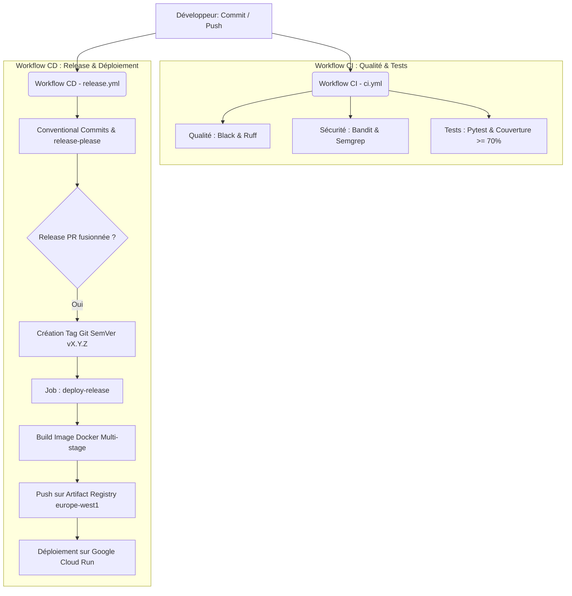

# Architecture du projet & Pipeline CI/CD

Cette page décrit l'architecture globale de notre usine logicielle et de notre pipeline d'intégration et de déploiement continu.

## Diagramme du Pipeline CI/CD

Voici le schéma représentant l'ensemble du cycle de développement, de validation et de livraison automatique de notre application Flask :

## Choix Technologiques & Bonnes Pratiques

### 1. Sécurité (SecOps)
* **Headers de Sécurité :** L'application intègre des en-têtes HTTP de sécurité (`X-Frame-Options`, `Content-Security-Policy`, `X-Content-Type-Options`) injectés à toutes les réponses à l'aide d'un hook `@app.after_request`.
* **Analyse Statique (SAST) :** `Bandit` analyse le code Python pour identifier d'éventuelles vulnérabilités communes, tandis que `Semgrep` valide les règles de sécurité spécifiques.
* **Audit des Dépendances :** `pip-audit` vérifie à chaque push l'absence de vulnérabilités connues (CVE) dans les packages du fichier `requirements.txt`.

### 2. Containerisation Optimisée (Docker Multi-stage)
* L'image de production utilise un processus de construction multi-étapes (**multi-stage build**) pour isoler le compilateur et les packages de développement de l'image de run.
* **Résultat :** Une image minimale, sécurisée et d'une taille réduite de **72%** par rapport à une image standard.

### 3. Gestion de Version Automatisée (SemVer)
* Grâce à `release-please`, le projet s'auto-documente et gère son versioning à chaque modification de code en respectant les **Conventional Commits**.
